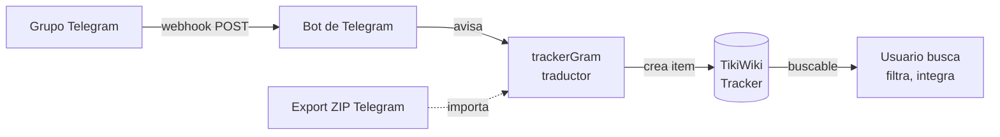

# TECHNICAL-basico.md — Cómo funciona trackerGram (para curiosos)

> **Nivel: pocos conocimientos técnicos** — Esta guía explica qué hace trackerGram, cómo lo hace y por qué, sin necesidad de leer código. Para detalle técnico con código, decisiones y deuda, ver [`TECHNICAL-avanzado.md`](TECHNICAL-avanzado.md). Hub: [`TECHNICAL.md`](TECHNICAL.md) · Schema: [`docs/TRACKER_SCHEMA.md`](docs/TRACKER_SCHEMA.md)

---

## Resumen en 5 puntos

1. **Problema:** Un grupo de Telegram genera conversaciones valiosas que se pierden en el chat.
2. **Solución:** trackerGram escucha esos mensajes y los copia a un **tracker de TikiWiki** (como una planilla con 28 columnas) donde quedan buscables y permanentes.
3. **Cómo:** Telegram avisa con un *webhook* (un mensaje automático a tu servidor) cada vez que alguien escribe.
4. **Qué guarda:** Texto, fotos, videos, audios, stickers, ubicaciones, contactos, encuestas, reacciones, replies y eventos del grupo (alguien entra/sale, se crea un topic).
5. **Extra:** También puede importar historial viejo desde un ZIP exportado de Telegram.



---

## Glosario mínimo

| Palabra | Qué es en trackerGram |
|---|---|
| **Tracker** | Una tabla/base de datos de TikiWiki. Cada fila es un *item*. Aquí cada mensaje de Telegram es un item. |
| **Campo / Field** | Una columna de esa tabla (ej. Texto, Fecha, Foto). Hay 28 campos. |
| **permName** | Nombre interno del campo, ej. `telegrammessageText`. Si tu tracker usa prefijo `soporte`, será `soporteText`. |
| **File Gallery** | Carpeta de TikiWiki donde se guardan las fotos/videos. El campo `Media` guarda la referencia. |
| **Webhook** | Un aviso automático: Telegram hace un POST a tu URL (`api.php`) cada vez que pasa algo en el grupo. |
| **Topic / Forum** | Sub-tema dentro del grupo (como canales). Cada mensaje puede pertenecer a un topic. |
| **MessageId + ChatId** | Identificador único de un mensaje: `chat_id` (qué grupo) + `message_id` (qué mensaje). |

---

## Ejemplo de punta a punta

> **En Telegram:** Juan escribe en el topic *Importante* del grupo *QPCH*: `Hola #urgente` + foto de una planilla.
>
> **En TikiWiki:** trackerGram crea un item con:
> - **Texto:** `Hola #urgente` · **Hashtags:** `urgente`
> - **TopicTitle:** `Importante` · **DisplayName:** `Juan` · **ChatTitle:** `QPCH`
> - **MessageType:** `photo` · **Media:** foto en File Gallery · **MediaUrl:** link público
> - **MessageDate:** fecha del mensaje
>
> Ese item es buscable por `urgente`, filtrable por fecha/usuario, y su foto no se pierde.

---

## Paso a paso, sin código

### 1. Telegram avisa (webhook)

Telegram no espera a que preguntes. Cuando alguien escribe, Telegram hace un POST a tu servidor (`api.php`). Es como el correo que toca tu puerta en vez de que revises el buzón cada segundo.

El servidor verifica dos cosas: que el aviso venga realmente de Telegram (un *secret* en el header) y de qué grupo es (`chat.id`).

### 2. Entendemos el mensaje

Cada aviso trae un JSON con el texto, quién escribió, fecha, y si hay foto/video/documento/sticker/ubicación etc. Un mensaje puede traer texto **y** foto a la vez.

trackerGram mira esos campos en orden y decide el tipo: si hay `photo` es foto, si hay `video` es video, si no hay nada raro es `text`.

### 3. Lo guardamos en TikiWiki

TikiWiki no habla JSON. Espera un formulario con `fields[nombreDelCampo]=valor`. trackerGram traduce el mensaje a ese formato.

Cada campo tiene un prefijo (ej. `telegrammessageText`). Si tu tracker usa `soporteText`, trackerGram lo detecta solo la primera vez y lo recuerda (`field_prefix_checked`).

### 4. Fotos, videos y álbumes

Telegram manda un `file_id` (un ticket). trackerGram pide la URL de descarga, baja el archivo (verifica que no pese más de 20 MB) y lo sube a la File Gallery de TikiWiki. Luego guarda el link en el item.

Si mandas 3 fotos como álbum, Telegram las manda como 3 mensajes separados con el mismo `media_group_id`. trackerGram las agrupa en **un solo item** usando un buffer con lock, así no quedan 3 items iguales. La segunda y tercera foto se pegan al mismo item.

### 5. Topics (para qué sirve)

Los grupos con topics tienen `message_thread_id`. El nombre del topic no viene en cada mensaje, solo cuando se crea el topic (`forum_topic_created`). trackerGram guarda `chatId:topicId → "Nombre"` en `tmp/topic_names.json` y lo reutiliza. Si no lo conoce, pone `Topic-42` o `General`.

### 6. No duplicamos

Telegram a veces manda el mismo aviso dos veces. Antes de crear un item, trackerGram pregunta: ¿ya existe `(chat_id, message_id)`? Desde v0.7.1 lo hace con un cache local `tmp/message_ids_{trackerId}.json` (no pregunta a Tiki cada vez) y un lock por mensaje para que dos avisos simultáneos no creen dos items.

### 7. Si algo falla, reintentamos

Si Tiki está lento, trackerGram espera 0.1s y reintenta (2 intentos para API, 3 para media). No usa `sleep(1)` que bloquearía el servidor.

### 8. Traer historia vieja (ZIP)

Telegram te deja exportar un ZIP con `result.json` + fotos. El ZIP tiene otro formato (fechas en texto, `photo` es nombre de archivo). trackerGram tiene un parser aparte que lee ese ZIP, indexa los archivos una sola vez, y usa el mismo traductor. Si una encuesta (`poll`) llegó por webhook sin votos, el import la enriquece con los votos reales.

---

## Cómo se ve por dentro (resumen)

```
Telegram (grupo + bot)
   ↓ webhook POST
api.php (verifica secret + chat_id + rate limit)
   ↓
WebhookHandler (traduce, evita duplicados, baja media, agrupa álbumes)
   ↓
TikiWiki Tracker (28 campos + File Gallery) → buscable
```

Para el diagrama detallado con `lib/Infra/ConfigManager`, `lib/Handler/WebhookHandler`, `tmp/dedup_locks/` y `message_ids_{id}.json`, ver [`TECHNICAL-avanzado.md`](TECHNICAL-avanzado.md#diagrama-de-flujo).

---

## 5 lecciones clave (en lenguaje llano)

1. **No duplicar:** Dos mensajes nunca tienen el mismo `(chat, id)`.
2. **Separar recibir de procesar:** `api.php` solo recibe, la lógica vive en el Handler.
3. **Texto plano no es HTML:** Se limpia con `strip_tags()` antes de guardar, el formato va aparte.
4. **Fotos sin bloquear:** Se verifica tamaño con HEAD y streaming, no se carga todo en memoria.
5. **Un mensaje, un item:** Los álbumes se pegan, no se multiplican.

Para las lecciones técnicas con código (`usleep` vs `sleep`, `innerHTML` → `textContent`, `CURLOPT_RESOLVE`), ver [`TECHNICAL-avanzado.md`](TECHNICAL-avanzado.md#lecciones-aprendidas).

---

## ¿Y ahora?

* **Quieres instalar:** [`INSTALL.md`](INSTALL.md) (Paso 3: `cp .env.example .env`)
* **Quieres ver campos:** tabla 28 campos arriba + INI completo en [`docs/TRACKER_SCHEMA.md`](docs/TRACKER_SCHEMA.md)
* **Quieres código:** [`TECHNICAL-avanzado.md`](TECHNICAL-avanzado.md) (Pasos 1-8 con snippets, deuda v0.7.1, seguridad)
* **Quieres contribuir:** [`docs/CONTRIBUTING.md`](docs/CONTRIBUTING.md)
